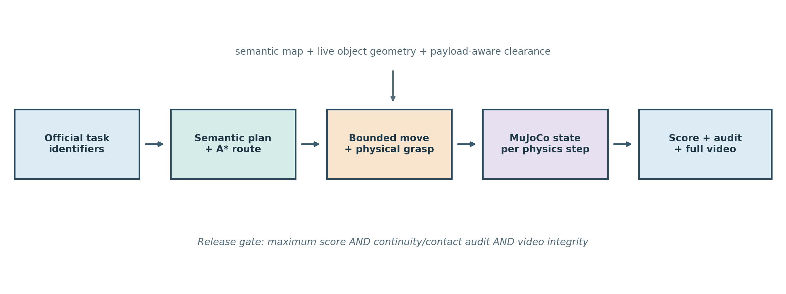
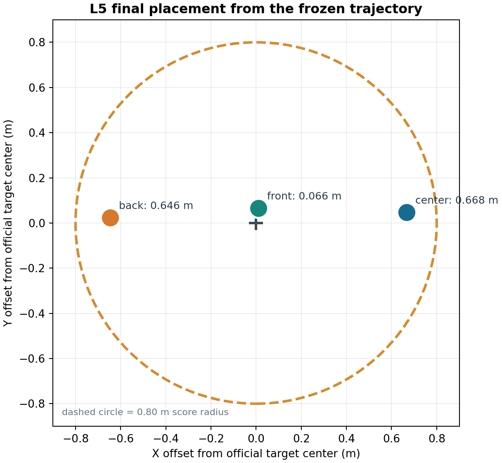
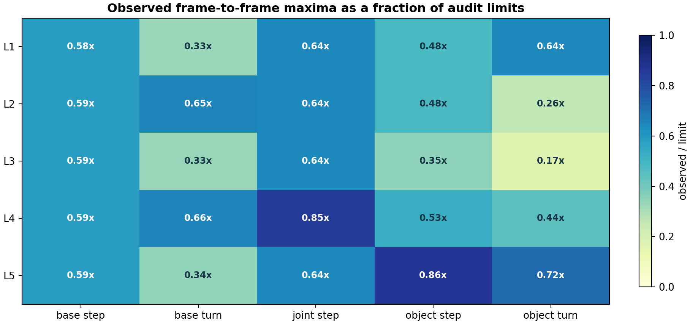
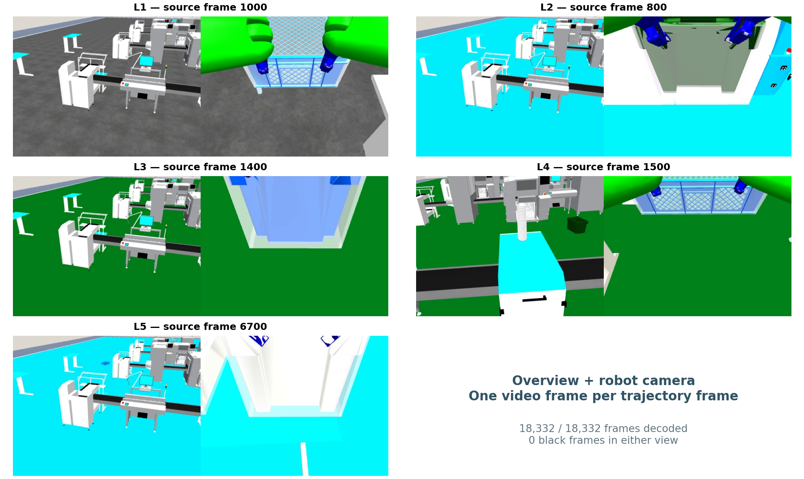

# Reality-Constrained Mobile Manipulation for JCIIOT 2026 RunningRobot

**Team:** BIPT-EDU  
**Report date:** 2026-08-05  
**Official reference commit:** `129e94a9cff787031472045e19c24a4baeaefc48`  
**Frozen final result:** 100/100; five strict realism audits PASS; five full-frame videos PASS  
**Evidence boundary:** all numbers in this report come from the frozen L1-L5 runs listed in `results/final_run_summary.json`. No failed development trajectory is included in the deliverable.

## 1. Executive summary

This report describes a mobile-manipulation solution for the five JCIIOT 2026 RunningRobot factory-sorting levels. The robot must resolve a source and destination, navigate a large factory scene, grasp the specified container with two arms, transport it while avoiding stations and other materials, and physically release it at the target. L5 repeats the complete cycle for three neighboring totes without disturbing earlier placements.

The final solution is a geometry-grounded, fail-closed execution stack. A semantic plan selects `move -> pick_up -> move -> place_down`; an 8-connected A* planner produces collision-aware routes; a dual-arm operational-space controller performs approach, grasp, lift, lowering, and release; and a payload-aware departure planner prevents a carried tote from sweeping through adjacent source objects. The simulator state is recorded after every physical step. A separate realism auditor then checks frame-to-frame continuity, reconstructs MuJoCo contacts during every held frame, and rejects any recorded collision or unintended material contact.

The frozen final runs score 10/10, 15/15, 20/20, 25/25, and 30/30, for 100/100 overall. They contain 18,332 recorded frames and seven successful grasps. Across all five runs, the maximum base translation is 0.035113 m per recorded frame, the maximum base rotation is 0.052434 rad per frame, recorded collision frames are zero, and held-material-to-unheld-material contact frames are zero. Gripper contact is present for 99.38% to 100% of held frames, depending on level. Each L1-L5 video contains exactly one rendered frame for every source trajectory frame and passes a complete decode test.

The speed optimization is deliberately safety constrained. The final navigation setting is 0.70 m/s at 20 Hz, yielding at most about 3.5 cm of commanded translation per control frame. Faster candidate profiles were not retained when they reduced physical plausibility or payload clearance. The current result improves route efficiency through source-departure geometry, accurate staging, and fewer failed retries; it does not gain speed by skipping recorded physics frames, teleporting the robot, or transporting objects between poses.



## 2. Task, scope, and evidence model

### 2.1 Task structure

L1-L4 each require one container transfer. L5 requires three transfers from the same crowded input station to the same auxiliary output table. The objective score is gated by successful grasp events, leaving the source region, arriving within the official target radius, and avoiding the judge collision penalty. The maximum scores are 10, 15, 20, 25, and 30 points.

Final execution uses explicit official identifiers from `knowledge/task_config.json`. This removes natural-language naming ambiguity while preserving the same task semantics. Each level runs in a fresh process and fresh environment. The code, task configuration, motion parameters, scoring reference, and realism thresholds are frozen before the five final runs.

### 2.2 Evidence hierarchy

The deliverable uses four independent evidence layers:

1. `trajectory.json` is the simulator-emitted state sequence, including robot joints, base pose, material poses, events, and collision flags.
2. `score.json` applies scoring rule `grasp_success_gate_l5_multi_v2` against official semantic-map centers at reference commit `129e94a9cff787031472045e19c24a4baeaefc48`.
3. `realism_audit.json` checks continuity and reconstructs contact pairs from each recorded state. It never edits a trajectory.
4. `Lx_dualview_full.mp4` is rendered from the same trajectory. Its metadata binds the source trajectory and video with SHA-256 hashes; `video_verification.json` records a complete decode of every frame.

Score and realism are conjunctive release gates. A run is accepted only if it reaches the maximum objective score and passes every realism check. A nominal score alone is insufficient.

### 2.3 Realism requirements

The implementation explicitly prohibits the following as runtime fallbacks:

- directly placing an ungrasped object at a target;
- changing an object from source pose to destination pose in one state transition;
- moving the base from one waypoint to another without bounded intermediate states;
- turning a carried payload through neighboring material objects;
- ignoring contact with unheld materials;
- fabricating missing physics results as success.

Legacy `pick_object()` and `place_object()` kinematic APIs are disabled in the MuJoCo backend. Grasp and release must succeed through the physical skill path. Initialization state may be copied into a newly created wrapped grasp environment, but the copied state equals the last recorded navigation state and therefore does not create an observable trajectory discontinuity.

## 3. Technical description

### 3.1 Architecture

The system separates task semantics, geometry, execution, and evidence:

```text
official task identifiers
        |
        v
semantic plan: move -> pick_up -> move -> place_down
        |
        +---- semantic map + occupancy grid ---- A* route
        |
        +---- live MuJoCo object/grasp sites --- grasp frame
        |
        v
bounded base motion + dual-arm OSC + carried-object attachment
        |
        v
per-step trajectory -> objective score -> realism audit -> full-frame video
```

Semantic decisions are deterministic in the final run. Geometric decisions use live simulator poses, not hard-coded destination teleports. Motion functions return failure if a required controller, attachment, path, clearance test, or contact condition is missing.

### 3.2 Navigation and safe speed profile

`MoveSkill` resolves the named station to its official approach point and plans an 8-connected A* path on the generated occupancy grid. Obstacle inflation accounts for the mobile manipulator footprint. A clearance ladder allows the planner to relax margins only when a more conservative route is unavailable. Small start and goal neighborhoods are treated specially because valid station approach points lie close to station geometry.

The final base profile is:

| Parameter | Final value | Safety purpose |
|---|---:|---|
| Control frequency | 20 Hz | one bounded update per control frame |
| Maximum linear speed | 0.70 m/s | approximately 0.035 m maximum commanded step |
| Maximum angular speed | 1.20 rad/s | approximately 0.060 rad theoretical step |
| Waypoint tolerance | 0.01 m | prevents coarse endpoint acceptance |
| Endpoint settle | 5 steps | lets contacts and pose converge |
| Transport retreat | 1.0 m | clears the source table before routing |
| Transport lane | 2.2 m | clears neighboring source materials |

The backend advances the base in bounded increments and records every update. Each increment is followed by MuJoCo state propagation, attachment synchronization if an object is held, and collision inspection. The final runs observed at most 0.035113 m translation and 0.052434 rad rotation per frame, both below the audit limits.

This base implementation is a kinematic simulator drive rather than wheel-torque control; that limitation is stated explicitly in Section 7. It is nevertheless temporally continuous at the submitted sampling rate and does not jump between distant poses.

### 3.3 Geometry-derived dual-arm grasp

`PickUpSkill` first validates the requested material against the live scene and computes the approach from the object center and its model grasp sites. When a default site lies behind a scene proxy, a calibrated grasp frame is rotated to an accessible wall while preserving the actual object pose. The resulting base pose, yaw, and pinch points are passed to the scripted expert.

The scripted expert performs a physically stepped sequence:

1. stow the arms before narrow navigation where required;
2. move to a safe height with operational-space control;
3. move horizontally above the live pinch sites;
4. descend with closed-loop Cartesian feedback;
5. close both grippers;
6. validate finger-pad contact;
7. lift the container and validate lifted height.

The final grasp profile records every simulation step (`record_frame_interval = 1`), allows up to 300 lift-control steps, uses a 0.02 m lift tolerance, and holds for 20 steps. The official collector's step function is wrapped so that intermediate controller steps are recorded, not merely phase endpoints.

If the physics grasp is unavailable or contact validation fails, the skill fails. There is no non-physics success fallback.

### 3.4 Continuous handoff between navigation and grasp environments

Grasp execution uses a wrapped evaluation environment. A fresh reset would normally restore all material objects to their spawn poses and could silently undo an earlier L5 placement. Before entering the wrapper, the solution snapshots the complete live material state and all non-base robot joints. The wrapper is initialized with that exact state, and its reset hook reapplies the snapshot before grasp motion begins.

After grasp, the target object's real grasp state is synchronized back to navigation while every non-target object retains its live pre-grasp state. This acts as a transactional state handoff:

```text
navigation state N
   -> initialize wrapped grasp state exactly from N
   -> simulate grasp to state G
   -> commit target and robot state from G
   -> preserve non-target material state from N
```

The procedure is especially important in L5, where the second and third wrapped grasps must not restore previously delivered totes to the input station.

### 3.5 Carried-object transport

After dual-gripper contact and lift validation, the transport utility captures the object's transform relative to the robot. During base motion, that relative transform is updated at every recorded step. This is a continuous simulator attachment, not a source-to-target relocation. The realism audit independently confirms gripper-object contact for at least 99% of held frames and checks that the held object does not contact any other material object.

Navigation collision logic ignores only the ground and the currently held object where necessary for the attachment. Fixtures, stations, and all unheld material objects remain collision-relevant. `follow_path()` stops and returns failure when a forbidden contact is observed.

### 3.6 Payload-aware source departure

The most demanding geometry occurs at the L5 input table: three target totes begin side by side, and rotating the front tote in place can sweep it through the center tote. The final solution avoids that failure class with a payload-aware departure plan:

1. derive the outward direction from the held object to the base;
2. select the tangential direction from the initial A* route, not simply the destination bearing;
3. translate outward by 1.0 m;
4. continue along a 2.2 m clearance lane;
5. replan globally from the lane exit.

The fine-grained passability check uses 0.05 m sampling. Only the first 0.10 m may use an endpoint escape mask so a conservative occupancy cell does not block a valid direct retreat; the remainder must be passable. If translation is impossible, an in-place payload turn is considered only after an arc preflight verifies at least 0.65 m clearance from every other material center. The check is fail-closed.

L5 processes the crowded source in `front -> center -> back` order. This exposes a safe outward corridor for each next object and avoids carrying one tote through another.

### 3.7 Physical placement

At the destination, the robot first retreats to an open staging point, turns continuously, and approaches the table in a straight line. Both arms and the attached object are lowered together using operational-space control. The grippers then open, the attachment is cleared, and MuJoCo is stepped for 60 release frames so the object can settle on the table.

The three L5 drops use lateral offsets of 0.00, +0.65, and -0.65 m relative to the target approach. Navigation and placement use the same offset, avoiding a final sideways sweep. Final distances from the official target center are 0.065845 m for the front tote, 0.667618 m for the center tote, and 0.646361 m for the back tote, all inside the 0.80 m scoring radius.



### 3.8 Per-step realism auditor

`audit_trajectory_realism.py` is separate from the executor and score calculator. It rejects a run if any threshold is exceeded:

| Quantity | Limit |
|---|---:|
| Base translation per frame | 0.06 m |
| Base rotation per frame | 0.08 rad |
| Robot joint change per frame | 0.35 |
| Material translation per frame | 0.10 m |
| Material rotation per frame | 0.25 rad |
| Held-frame gripper contact fraction | at least 0.99 |
| Recorded collision frames | 0 |
| Held-material to other-material contact frames | 0 |

For each held frame, the auditor reconstructs the recorded state in the same MuJoCo scene, calls forward propagation, enumerates active contact pairs, and classifies contacts by robot, held material, unheld material, fixture, and ground. This catches a carried payload striking another tote even if a coarse base-only collision flag would miss it. Audit JSON records the worst transition, its frame number, missing-contact frames, unintended pairs, thresholds, and explicit failures.



### 3.9 Full-frame video generation and verification

The demonstration renderer replays the frozen trajectory state by state. Each source frame produces exactly one H.264 frame at 20 FPS; `subsample_step` is 1. The composite view is 768 x 288 pixels and pairs an environment overview with `robot0_robotview`. L4 uses `agentview` for the overview because it gives a clearer scene composition; the other levels use `frontview`.

The video verifier opens each MP4 independently with OpenCV and decodes it to end-of-stream. It checks declared, decoded, metadata, and source frame counts; both view halves are checked for black frames; and SHA-256 hashes are recomputed. All five videos pass. Video is qualitative evidence and does not replace score or contact verification.



### 3.10 Implementation and third-party software

The participant implementation is concentrated in the following files (paths are relative to `source_code/`):

| Path | Responsibility |
|---|---|
| `robot_agent/skills/move.py` | semantic target resolution, A*, L5 offsets, payload-aware departure |
| `robot_agent/skills/pick_up.py` | live object validation, exact pose handoff, scene snapshot, physics-only grasp |
| `robot_agent/skills/scripted_grasp.py` | per-step recording and closed-loop dual-arm expert |
| `robot_agent/skills/place_down.py` | matched target offsets and physics-only placement |
| `robot_agent/environments/robosuite_backend.py` | bounded base drive, collision checking, lowering, release, continuous turn |
| `pipeline/audit_trajectory_realism.py` | offline continuity and reconstructed-contact audit |
| `pipeline/render_trajectory_video.py` | full-frame dual-view video rendering |
| `knowledge/robot_params.json` | frozen motion and audit-relevant parameters |

Third-party and organizer software is acknowledged below. Versions are those in the final environment.

| Component | Version | Use | License / source |
|---|---:|---|---|
| MuJoCo | 3.9.0 | dynamics, contacts, rendering | Apache-2.0; official computation documentation [8] |
| robosuite fork | 1.5.2 | robot models, controllers, factory environments | MIT; robosuite paper [2] |
| robomimic | 0.5.0 | optional behavior-cloning infrastructure | MIT; robomimic paper [3] |
| NumPy | 1.26.4 | geometry and trajectory analysis | BSD-3-Clause |
| SciPy | 1.15.3 | numerical utilities | BSD-3-Clause |
| PyTorch | 2.7.0+cu126 | optional BC checkpoint runtime | BSD-style |
| OpenCV Python | 4.8.1.78 | independent video decode verification | Apache-2.0 |
| ReportLab | 5.0.0 | PDF report generation only | BSD-style |

The official scene assets, task definitions, and scoring reference remain organizer-provided. The final deterministic expert path does not require online LLM or network access.

## 4. Novelty statement and relation to prior work

### 4.1 Claimed contribution

The contribution is not a new universal robot-learning algorithm. It is a competition-specific reliability architecture for a known mobile-manipulation domain. Its distinctive elements are:

1. **Score-plus-reality release gating.** Full objective score is necessary but not sufficient; continuity, contact reconstruction, collision state, and full-frame video integrity must also pass.
2. **Payload-aware departure rather than base-only planning.** The first meters after grasp are planned using the carried object's geometry, route direction, neighboring material locations, and a swept-turn preflight.
3. **Transactional cross-environment continuity.** A wrapped grasp rollout begins from the exact live scene and commits only the new target/robot state while preserving all non-target objects.
4. **Physical fail-closed manipulation.** Missing grasp, lift, attachment, route, turn clearance, lowering, or release capability returns failure; direct pick/place and animation fallbacks are disabled.
5. **Per-physics-step evidence.** The recorder instruments every physical controller step, enabling frame-level limits and reconstructed contact auditing rather than phase-level screenshots.

Together these mechanisms address a common gap in fixed-scene competition systems: an objective evaluator may accept a final pose even when the intermediate motion is implausible. The proposed release gate makes the intermediate trajectory a first-class result.

### 4.2 Relationship to established and current methods

A* is the classical foundation for minimum-cost heuristic graph search [1]. This solution retains A* and adds manipulator-footprint inflation, endpoint escape bounds, route-aligned source departure, and payload arc preflight. These additions are application-layer safety mechanisms, not a replacement for A*.

robosuite provides modular robot simulation and controller infrastructure [2], while robomimic studies strong offline imitation-learning baselines and the design factors that matter for robot manipulation [3]. Behavior cloning remains available in the repository, but the final known-scene execution uses a deterministic closed-loop expert because it is easier to audit. DAgger formalizes how sequential imitation errors can compound when the learned policy encounters states outside its training distribution [4]; our fixed-scene response is explicit geometry and fail-closed recovery rather than additional online data collection.

Recent manipulation systems pursue broader policy capability. Diffusion Policy models multimodal visuomotor actions with conditional diffusion [5]. Action Chunking with Transformers (ACT) targets fine-grained bimanual manipulation and predicts action sequences [6]. Mobile ALOHA combines whole-body teleoperation and imitation learning for bimanual mobile manipulation [7]. Those systems address data-driven generalization and complex behavior acquisition. This solution advances a different axis: deterministic execution, intermediate-state continuity, and auditability in five fixed official scenes.

| Dimension | Diffusion / ACT / learned-policy direction | This solution |
|---|---|---|
| Primary goal | learn expressive policies from demonstrations | reliable execution in known official geometry |
| Generalization | central research objective | explicitly limited to L1-L5 scenes |
| Data requirement | demonstrations and training | semantic maps, live geometry, optional checkpoint |
| Intermediate safety evidence | policy and benchmark dependent | frame limits plus reconstructed contacts |
| Failure behavior | policy dependent | fail closed at named skill boundaries |
| Claimed result | broader task-policy capability | 100/100 plus five realism-audit passes |

### 4.3 Novelty boundary

We claim novelty for the integration and competition application of these mechanisms, not for A*, obstacle inflation, operational-space control, object attachments, or offset placement individually. The result does not demonstrate superiority over general-purpose learned policies, does not establish research-benchmark state of the art, and does not prove real-world safety. It demonstrates that all five fixed simulator levels can be solved at full objective score while retaining continuous, contact-audited intermediate motion.

## 5. Experimental protocol

### 5.1 Frozen-run procedure

The final code and `robot_params.json` were frozen before the accepted runs. Each level then followed the same sequence:

1. start a fresh headless MuJoCo process;
2. execute the canonical official task;
3. save the untouched `_OK.json` trajectory;
4. compute the objective score against the frozen official reference;
5. run the strict realism auditor;
6. accept the run only if score and audit pass;
7. render the accepted trajectory at one video frame per trajectory frame;
8. fully decode and hash-check the video.

No trajectory JSON was edited between execution, scoring, auditing, rendering, and packaging. SHA-256 binds the video metadata to the trajectory used for rendering.

### 5.2 Reproducibility controls

- official reference commit and score-rule version are stored in each score and manifest;
- run stamps and environment identifiers are stored in `final_run_summary.json`;
- every per-level evidence directory contains trajectory, score, realism audit, and result metadata;
- official submission ZIPs contain exactly `trajectory.json`, `score.json`, and `submission_manifest.json`;
- `SHA256SUMS.txt` covers the five submission ZIPs;
- the top-level bundle has its own checksum manifest;
- source overlays and the relevant robosuite factory-sorting overrides are included.

## 6. Results and analysis

### 6.1 Objective score and run size

| Level | Environment | Score | Frames | Wall time (s) | Video duration (s) |
|---|---|---:|---:|---:|---:|
| L1 | FactorySorting1_3FO3ERFHISEM | 10/10 | 1,793 | 79.950 | 89.65 |
| L2 | FactorySorting3_3FO3ERRPH7X9 | 15/15 | 1,674 | 75.260 | 83.70 |
| L3 | FactorySorting5_3FO3ERTPXEUT | 20/20 | 2,402 | 101.243 | 120.10 |
| L4 | FactorySorting7_3FO3ERFKY9RN | 25/25 | 2,324 | 117.107 | 116.20 |
| L5 | FactorySorting9_3FO3ERT2C5FP | 30/30 | 10,139 | 548.334 | 506.95 |
| **Total** | five environments | **100/100** | **18,332** | **921.894** | **916.60** |

Wall time is one measured end-to-end run per level on the same host, not an average. Video duration is exactly `frames / 20 FPS`; it is not a claimed real-robot completion time. L5 dominates because it contains three complete grasp-transport-place cycles and records every physical control step.

### 6.2 Continuity and contact results

| Level | Base step (m) | Base turn (rad) | Joint step | Object step (m) |
|---|---:|---:|---:|---:|
| L1 | 0.035100 | 0.026382 | 0.225176 | 0.048384 |
| L2 | 0.035101 | 0.052271 | 0.225462 | 0.047969 |
| L3 | 0.035113 | 0.026600 | 0.225186 | 0.035006 |
| L4 | 0.035100 | 0.052434 | 0.299188 | 0.052564 |
| L5 | 0.035113 | 0.027476 | 0.225283 | 0.086433 |
| Audit limit | 0.060000 | 0.080000 | 0.350000 | 0.100000 |

| Level | Object turn (rad) | Held contact | Collision frames | Unintended material-contact frames | Audit |
|---|---:|---:|---:|---:|---|
| L1 | 0.160527 | 954 / 957 = 99.6865% | 0 | 0 | PASS |
| L2 | 0.064961 | 1,050 / 1,050 = 100% | 0 | 0 | PASS |
| L3 | 0.041349 | 1,178 / 1,180 = 99.8305% | 0 | 0 | PASS |
| L4 | 0.110816 | 997 / 997 = 100% | 0 | 0 | PASS |
| L5 | 0.179854 | 4,267 / 4,285 = 99.5799% | 0 | 0 | PASS |
| Audit limit | 0.250000 | at least 99% | 0 | 0 | — |

The largest L5 object translations occur during physical release and settling rather than source-to-target transport. They remain below 0.10 m per frame. Short missing gripper-contact intervals occur at attachment transitions or release boundaries; all levels remain above the 99% threshold, and the object's motion remains continuous.

### 6.3 L5 multi-object analysis

| Object | Held frames | Contact frames | Contact fraction | Final target distance |
|---|---:|---:|---:|---:|
| front | 1,411 | 1,403 | 99.4330% | 0.065845 m |
| center | 1,437 | 1,427 | 99.3041% | 0.667618 m |
| back | 1,437 | 1,437 | 100% | 0.646361 m |

All three totes are grasped, moved out of the source region, and placed inside the target radius. Earlier placements remain at the destination while later wrapped grasps execute. The zero unintended-contact count confirms that none of the three carried totes is transported through another material object in the accepted run.

### 6.4 Video results

| Level | File | Frames decoded | FPS | Resolution | Black frames | Result |
|---|---|---:|---:|---:|---:|---|
| L1 | `L1_dualview_full.mp4` | 1,793 | 20 | 768 x 288 | 0 | PASS |
| L2 | `L2_dualview_full.mp4` | 1,674 | 20 | 768 x 288 | 0 | PASS |
| L3 | `L3_dualview_full.mp4` | 2,402 | 20 | 768 x 288 | 0 | PASS |
| L4 | `L4_dualview_full.mp4` | 2,324 | 20 | 768 x 288 | 0 | PASS |
| L5 | `L5_dualview_full.mp4` | 10,139 | 20 | 768 x 288 | 0 | PASS |

The decoded counts exactly equal the trajectory and metadata counts. Neither half of any composite video contains a black frame. Videos show the full accepted trajectories; there are no shortened highlight-only substitutes in the final package.

### 6.5 Strengths

- perfect objective score on all five official scenes;
- explicit prevention of direct pick/place and pose-jump fallbacks;
- per-step recording across navigation and controller internals;
- payload-aware departure and collision checks that include other materials;
- transparent, machine-readable realism limits and worst-case values;
- exact L1-L5 video/trajectory frame correspondence;
- deterministic final execution without network services.

### 6.6 Speed analysis and safe opportunities

The current profile prioritizes credible motion over minimum wall time. The most valuable implemented speed improvement is avoiding retries and long detours: the route-derived departure lane clears the source table once, then replans from open space. Exact grasp-state handoff also avoids resetting or repeating earlier L5 work.

Further safe optimization should target computation rather than larger physical jumps:

- cache static collision geometry used by reconstructed-contact audits;
- simplify A* paths while retaining the 0.06 m frame limit and continuous collision tests;
- render videos in parallel after trajectories are frozen;
- profile controller settling and reduce only frames that have already converged;
- encode videos asynchronously, since encoding does not affect robot physics.

Raising base steps toward the audit limit or reducing contact settling could shorten runs, but it would reduce safety margin and requires a fresh L1-L5 rerun and audit. This package does not make that trade.

## 7. Limitations

1. **Fixed-scene evaluation.** Results cover five known official simulator scenes. The method is not evaluated on unseen layouts, object shapes, lighting, or randomized dynamics.
2. **No real-robot deployment.** MuJoCo contact realism does not prove hardware safety. Sensor noise, actuator delay, compliance, wheel slip, calibration error, and emergency-stop design are outside this evaluation.
3. **Kinematic mobile base.** The base is advanced through bounded simulator joint increments rather than wheel-torque dynamics. The trajectory is temporally continuous, but it is not a wheel-controller validation.
4. **Simulator attachment while carrying.** A gripper-relative transport attachment maintains the grasp during mobile motion. Its per-frame motion and contact are audited, but it is not equivalent to modeling all real grasp forces.
5. **Single final run per level.** The report presents deterministic final runs, not repeated-trial success rates or confidence intervals.
6. **Engineering thresholds.** Continuity and contact limits are conservative competition guardrails, not formal safety certificates.
7. **Video presentation.** The overview camera is intentionally wide to show the factory; small objects can be difficult to see there, so the paired robot camera is needed for manipulation detail.

These limitations bound the novelty and performance claims. The evidence supports full-score, continuity-audited execution in the provided simulation, not universal physical realism.

## 8. Reproduction and package guide

The final bundle layout is:

```text
README.md
TECHNICAL_REPORT.md
output/pdf/TECHNICAL_REPORT.pdf
submission/L1_*.zip ... L5_*.zip
submission/SHA256SUMS.txt
evidence/L1 ... L5/
  trajectory.json
  score.json
  realism_audit.json
  run_result.json
videos/L1_dualview_full.mp4 ... L5_dualview_full.mp4
videos/*.metadata.json
results/final_run_summary.json
results/video_verification.json
results/package_verification.json
source_code/
verify_submission.py
FINAL_CHECKSUMS.sha256
```

Run `python verify_submission.py` from the extracted bundle to recompute official-package integrity and scores. The packaged verification report records the expected PASS result. `results/final_run_summary.json` is the compact source for every quantitative table in this report.

## 9. Conclusion

The final JCIIOT RunningRobot solution achieves 100/100 across L1-L5 while preserving continuous intermediate motion and explicit contact evidence. The key improvement is not a more permissive scorer; it is a stricter release process. Physical grasp and release, bounded base motion, payload-aware departure, transactional state handoff, reconstructed-contact auditing, and full-frame video verification all have to agree before an artifact is accepted.

This approach trades some execution time for a substantial increase in credibility. The result is a clean final package with no failed development trajectories or obsolete videos, five score-maximizing submissions, five PASS realism audits, and five source-complete demonstrations.

## References

[1] P. E. Hart, N. J. Nilsson, and B. Raphael, “A Formal Basis for the Heuristic Determination of Minimum Cost Paths,” *IEEE Transactions on Systems Science and Cybernetics*, 4(2), 100-107, 1968. DOI: [10.1109/TSSC.1968.300136](https://doi.org/10.1109/TSSC.1968.300136).

[2] Y. Zhu et al., “robosuite: A Modular Simulation Framework and Benchmark for Robot Learning,” 2020. [arXiv:2009.12293](https://arxiv.org/abs/2009.12293).

[3] A. Mandlekar et al., “What Matters in Learning from Offline Human Demonstrations for Robot Manipulation,” 2021. [arXiv:2108.03298](https://arxiv.org/abs/2108.03298).

[4] S. Ross, G. Gordon, and D. Bagnell, “A Reduction of Imitation Learning and Structured Prediction to No-Regret Online Learning,” *AISTATS*, PMLR 15:627-635, 2011. [Primary proceedings page](https://proceedings.mlr.press/v15/ross11a.html).

[5] C. Chi et al., “Diffusion Policy: Visuomotor Policy Learning via Action Diffusion,” *Robotics: Science and Systems XIX*, 2023. DOI: [10.15607/RSS.2023.XIX.026](https://roboticsproceedings.org/rss19/p026.html).

[6] T. Z. Zhao et al., “Learning Fine-Grained Bimanual Manipulation with Low-Cost Hardware,” 2023. [arXiv:2304.13705](https://arxiv.org/abs/2304.13705).

[7] Z. Fu et al., “Mobile ALOHA: Learning Bimanual Mobile Manipulation using Low-Cost Whole-Body Teleoperation,” *Proceedings of The 8th Conference on Robot Learning*, PMLR 270:470-488, 2025. [Primary proceedings page](https://proceedings.mlr.press/v270/fu25b.html).

[8] Google DeepMind, “MuJoCo Computation,” official documentation. [Computation chapter](https://mujoco.readthedocs.io/en/stable/computation/index.html), accessed 2026-08-05.
